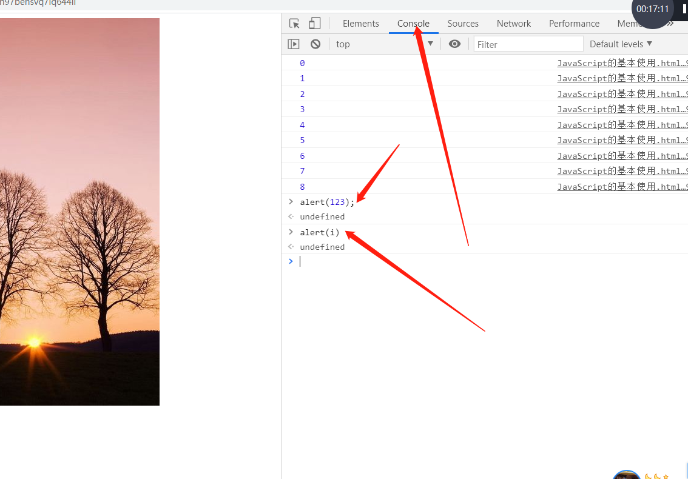

JavaScript主要实现行为控制
JavaScript的目的是**增强**页面的应用，如果没有js页面应该能够正常访问,满足基本业务,如果存在js让用户使用起来更加方便

# JavaScript基础知识

目前客户端编程的**唯一**选择

解释类脚本语言, 比较灵活

js可以运行在js的解释器上, 现代浏览器都拥有js的解释器

常见的js技术:   ECMAScript     ,   node.js       ,   TypeScript


# JavaScript

## 如何在页面中使用JavaScript

1	在HTML标签中使用事件属性[一般都是onxxxxx]的方式调用(不推荐)

   ```html

   ```

2	通过script标签,将JavaScript代码定义在script标签中

```html
<script>
    for (var i = 0; i < 9; i++) {
        console.log(i);
    }
</script>
```

3	独立定义一个js文件,在页面中通过script标签的src属性引入即可,如果具有src属性后,script标签中的代码不会执行

```html
<script src="js/main.js">alert("abcd");</script>
```

4	使用浏览器的控制台(F12)  



## 如何学习

https://www.w3cschool.cn/javascript/

https://www.w3cschool.cn/escript6/

### JavaScript和ECMAScript的关系

ECMAScript是语言的**标准**,JavaScript是ECMAScript标准的一个实现

ECMAScript定义了核心标准,没有具体实现

JavaScript   =   ECMAScript   +    BOM浏览器对象模型    +    **DOM**文档对象模型

语法类似于java


## JavaScript的输入

1	通过console控制台进行输入   

2	通过表单输入数据[DOM编程]

3	通过BOM对象的几个输入对象实现

​			alert	

​			confirm[返回true或者false]    

​			prompt   返回的是用户输入的字符串

​			

## JavaScript的输出

1	通过console控制台输出 例如  console.log("在控制台输出的信息");

2	输出内容到页面中	 例如   document.write("输出到页面中");

3	通过BOM对象输出

​			alert	

​			confirm[返回true或者false]    

​			prompt   返回的是用户输入的字符串


4	指定节点输出[DOM节点]	   (都可以作为右值[getter获得]或者左值[setter设置])

​		obj.value		只能对具有value属性的元素生效

​		obj.innerText	纯文本

​		obj.innerHTML	按照html格式解析

5	属性的输出

```html
 function changeImg() {
    var oImg = document.getElementById("myImg");
    // oImg.src = "img/01.jpg";
    oImg.setAttribute("src","img/01.jpg");
}

```

# JavaScript的语法

1	JavaScript是弱类型语言,变量可以任意存储数据,自我约束使用强类型的编程方式

2	变量的声明  使用关键字   var   或者   let

​	var声明的变量会有两个作用域[全局,函数]     ,函数内部可以覆盖全局的变量,如果变量声明时没有指定任何关键字,则创建全局变量

3	每行语句结束使用     ;    


JavaScript的语法要求很低 ,   代码无法工程化  ,   建议使用C的编程规范编码进行编码.    


# JavaScript的数据类型

## 字符串（String）:  

只要是在  " "    或者    '   '   或者    反向单引号[模板字串]中间的内容都是字符串

## 数字(Number):

包括    1       3.14      ,无需强转直接运算

数字中包括几个特例      

NaN(非数)   ,NaN不等于任意数, 就不能使用  ==  进行判断,使用isNaN判断   例如    isNaN(0/0)结果为true

Infinity:   无限值   

常用的转换函数:     parseInt    parseFloat    直到遇到第一个不是数字的字符则停止,如果不能转换返回NaN

Number也可以進行轉換，但是衹要字符串中有非数字字符则会返回NaN

## 布尔(Boolean)

true和false

7种假值：  false		""      NaN     0     -0      null        undefined

其他的都是true

## 空（Null）

当一个变量被设置为Null时，此时他将会被垃圾回收标记

## 未定义（Undefined）

当调用一个变量时，该变量未声明则返回undefined

当一个函数没有明确返回值的时候，则返回undefined

当函数声明了形参，但是调用时没有传递实参时，该形参为undefined

## 引用类型

数组

函数

正则表达式

对象(Object)


# 上课回顾

JavaScript常用的客户端编程脚本语言，jQuery，VUE，Node.js ， TypeScript

JavaScript特点： 解释性（解析执行--》浏览器内置的解析器），弱类型（变量可以不限定类型）

JavaScript作用：客户端的服务器编程 node.js  ，  浏览器中行为的控制

ECMAScript + BOM（浏览器对象模型）+DOM（文档对象模型）  = JavaScript

输入输出：


# 函数

什么是函数：    可以复用的代码片段，根据用户的输入进行处理产生输出，其他语言中可能叫做   过程，方法

函数的应用是： 先定义后调用

函数的定义：   使用关键字   function   进行，也可以使用lamda表达式（箭头语法）

函数的调用：  HTML的事件属性


## 函数的参数

JavaScript的函数调用时没有先后顺序

JavaScript的函数可以通过参量传入实参，但是由于JavaScript是弱类型语言，不允许出现重载,如果需要程序健壮，需要在函数内部自己编码实现约束

定义了参量但是调用时没有传递实参时，该参量为  undefined

## 函数的返回值

通过return实现返回

return后的语句不会执行

如果没有return则函数返回  undefined

如果函数返回false  ， 则代表取消事件的默认行为（超链接的跳转，表单的提交行为）

## 变量作用域

JavaScript【ECMAScript5】的变量只有两个作用域      全局      函数

全局的作用域   >   函数的作用域

按照C的编程规范编写，所有的变量都在头部声明和初始化

在函数内部声明变量时，如果没有指定关键字var  ，则变量会自动提升为全局变量，好的编程习惯应该在变量前都添加var关键字【防止自动提升】

全局变量容易造成变量污染

建议采用let替代var ，let是ECMAScript6 提出的标准，，let具有块作用域    {   }     

# 数组

同类型的变量为了方便调用通过连续的存储空间访问方式，通过统一的名称调用（下标索引）   

JavaScript中允许一个数组存储不同类型数据

JavaScript的数组是动态自增

JavaScript中，数组元素没有赋值时是   undefined

# 事件

事件是某种行为																	click      pressUp

行为发生之后采取的措施叫做时间处理函数【回调】		onclick    onPressUp


事件的使用

1	通过HTML的事件属性         

```html
<tag    onclick="javascript代码"></tag>
认识即可
```

2	基于DOM的事件编程

优点： 完全脱离了HTML限制，降低了HTML和JavaScript之间的耦合


## 事件冒泡

响应行为

### 事件委托案例

相册图片切换

### 事件的应用

通过事件委托的方式主要可以解决2个问题

1	可以给父容器添加事件，子元素可以触发，缩短代码处理

2	动态添加到父容器中的子元素也会响应事件

后添加的元素如何添加事件呢

1	给父元素添加事件通过事件委托模式实现

2	在创建元素的同时添加事件

3	使用系统提供的事件绑定方法吧     addEventListener(事件，回调函数，发生的阶段)


# JavaScript表单验证

1	可以通过pattern的正则表达式要求表单输入的内容符合格式

2	可以通过required的属性要求必须输入该内容

缺陷： 发生的时机是   点击  提交表单 按钮时

需要的结果：   如果填写过程中就可以判断用户感受会更好，如果所有的表单字段检测通过才允许提交

# 正则表达式

计算机中**字符串**的**匹配**最全面的方式就是正则表达式

JavaScript使用的是 **Perl风格**的正则表达式

JavaScript中正则表达式和数组等一样是一个对象

## 创建正则表达式的方式

```javascript
//1 字面量方式
//  /表达式的值/修饰符       i 忽略大小写    g  全局      m  多行模式匹配
var patt =  /^[0-9]{5}$/igm
//2 原型方式
var patt2 = new RegExp("^[0-9]{5}$","igm");//可控性较强

```

## 使用正则表达式

1	正则表达式对象自带的方法

​	test()，返回false或true

​	exec()，返回匹配的内容（null）

2	字符串对象提供的方法【重要】

​	切割字符串

​	敏感词过滤    ：   敏感词替换为对等个数的*


# JavaScript 错误处理 Throw、Try 和 Catch

try里面包含的语句都是和访问资源有关的

# DOM编程

JavaScript =  ECMAScript+BOM+DOM

DOM：文档对象模型

DOM：树形，由文档元素节点构成的，页面元素的对象表示方式，通过修改DOM树节点影响页面的显示【浏览器根据DOM树渲染数据】

DOM是一组API：提供了访问和处理DOM树的一组方法，代表 JavaScript和java和C++都可以通过DOM API处理DOM结构

DOM的编程： 增删改查

## DOM的基本结构：

DOM节点类型：

元素节点：标签

属性节点：属性

文本节点：内容

碎片节点：游离于dom之外，必须要挂载到DOM树才能被展示

## DOM编程

| 操作         | 原生JavaScript实现                                           | 其他实现 |
| ------------ | ------------------------------------------------------------ | -------- |
| 查找         | document.getElementById("id名称")：获得id元素对象【唯一】或者null，使用该方法时需要使用对象检测技术 |          |
|              | document.getElementsByTagName(“标签名”)：获得的是一个**集合**，可以通过数组方式访问 |          |
|              | document.querySelector(“选择器”) 获得元素对象【唯一】或者null |          |
|              | document.querySelectorAll(“选择器”) 获得元素对象集合         |          |
|              | 对象.getAttribute("属性名")   获取属性节点的值               |          |
| 查找（导航） | lastChild   .........................     找到的都是包括元素，文本等节点 |          |
|              | lastElementChild   .............   只找元素节点              |          |
| 修改         | innerHTML                                                    |          |
|              | innerText                                                    |          |
|              | value                                                        |          |
| 增加         | createElement创建元素节点                                    |          |
|              | createTextNode创建文本节点                                   |          |
|              | appendChild将节点追加到父节点                                |          |
|              | prepend将节点插入到父节点的第1位                             |          |
|              | setAttribute 设置属性节点                                    |          |
|              | insertBefore(oLi,oRef)   在参考节点前插入子节点              |          |
| 删除         | removeXXXXX（）  删除元素、属性等                            |          |

## DOM简单案例

点餐


# 综合案例：相册

演进路线：    iframe实现相册---》JavaScript实现--》完善JavaScript实现

追求的目标：

回顾知识点

设计想法，逐步增强，平稳退化

实现：组件化开发，公用的代码抽象成独立的函数

## 静态设计

给所有的图片添加超级链接，确保js失效的时候能够打开基本的链接内容